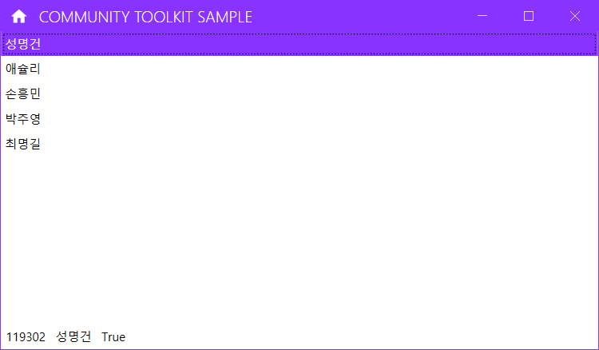

## MVVM 테스트

### CommunityToolkit.Mvvm (구 Microsoft.Toolkit.Mvvm)
1. WPF 프로젝트 생성
2. NuGet 패키지 설치 
    - CommunityToolkit.Mvvm
    - Microsoft.Extensions.DependencyInjection

3. App.xaml에 StartupUri 삭제
    - Startup 이벤트 추가, 작성
4. Models, Views, ViewModels 폴더 생성
    - MainWindow.xaml을 Views로 이동
    - MainView.xaml로 변경

5. Models.Person 클래스 생성
6. ViewModels에 MainViewModel.cs 생성
7. MainView.xaml 디자인 작업
8. MainView.xaml.cs 생성자에 ViewModel 연결

    

### CommunityToolkit.Mvvm + LiveChart2
1. LiveChartsCore.SkiaSharpView.WPF 추가
2. CommunityToolkit.Mvvm 추가
3. MahApps.Metro 추가
4. 생략

